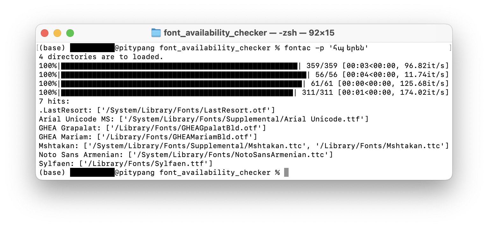

<!-- 注意：
* .ttcはfontNumber=0にしか対応していない
* macOSで、ディレクトリ内に存在するがFontBookに現れない（インストールされていない？）フォントがある
* GitHubで見るREADMEを書く
    * 多言語対応
* git commitを追加する
-->

# 特定の文字列を表示できるフォントの一覧を出力したい　
人には、特定の文字列を表示できるフォントの一覧を出力したくなるときがあります。

***
この記事は、「[語学・言語学・言語創作 Advent Calendar 2022](https://adventar.org/calendars/7668)」12日目の記事です。
***


## 経緯
11月某日、Discordで「ə」にCOMBINING VERTICAL LINE BELOW（U+0329）を合成する機会がありました。しかしフォントがこの組み合わせに未対応だったようで、表示が崩れる憂き目に遭うことになりました*。

\* 画像はgg sans採用前です。gg sansは「ŋ」との組み合わせにも対応していない（12月4日未明現在）ようで、表示はより崩れることになりました。悲しい。


普段なら放置するところですが、この日はなぜか気が向いたので、Font Book*でカスタム文字列に上の文字列を設定して、正しい表示ができているかどうか虱潰しに調べて行きました。結果、写真にある「[Koruri](https://koruri.github.io/)」を含むいくつかのフォントが対応していることがわかりました。

\* macOSのフォントマネージャであり、インストールされているフォントを一覧することができます。この作業をした当時のmacOS Montereyでは次のような見た目でした。


この作業を簡単にするために、プログラムを組むことにしました。


## 生成物
そうして出来上がったものがこちらです。
→[yatabashi/font_availability_checker](https://github.com/yatabashi/font_availability_checker)  
ある文字列を表示可能なフォントの一覧を出力するプログラムです。オプションとして、いくつかの条件が設定可能です。
* 検索対象：単一のフォント、単一ディレクトリ内のフォント、全フォント
* 検索方法：検索を徹底的に行う（サブファミリー名も確認し、Collectionファイルに対しては各フォントを精査する）かどうか
* 出力形式（検索対象が複数のフォントである場合のみ有効）：検索結果の出力にフォントファイルのパスを加えるかどうか


## 実行例
例えば、次のコマンドを実行した時のことを考えます。
```
fontac -p 'հայերեն'
```

このとき、次のような処理が行われます。

1. 設定を受け取る
1. 指定された文字列の表示に利用可能なフォントのフォント（ファミリー）名とファイルパスを保存するdict `D_a`を空で生成する
1. フォントファイルの格納されている各ディレクトリに対して以下を実行する：
    1. 指定された文字列の表示に利用可能なフォントのフォント（ファミリー）名とファイルパスを保存するdict `D`を空で生成する
    1. ディレクトリ内の各フォントファイルに対して以下を実行する：
        1. フォント（ファミリー）名を取得する
        1. 同名のフォントがすでに見つかっている場合は返る
        1. 利用可能な文字の一覧を取得する
        1. 指定された文字列（ここでは「հայերեն」）と(3.)を比較して、指定された文字列を表示可能であれば次を実行する：
            * フォント名とファイルパスを`D`に追加する
    1. `D`を`D_a`に、付け加える*
1. `D_a`を出力する

\* 一旦`D`を介しているのは、他の関数との兼ね合いのためです。



## 知識
* Pythonの話
    * `set`オブジェクトに対して、要素を一つ追加したい場合は`.add()`を、複数追加したい場合は`.update()`を用いる。
    * `str.endswith()`にはタプルを渡して、その中のいずれかに一致するかどうかを返させることもできる。
    * `os.path.abspath()`  
        自動的に相対パスを絶対パスに変換することができる。
    * `os.path.expanduser()`  
        ホームディレクトリの略記を自動的に展開することができる。
    * `logging.disable()`  
        基準以下の重要度のログの出力を抑制することができる。
    * `tqdm.tqdm()`  
        実行中のfor文の進捗を可視化することができる。簡単。すごい。
    * `sys.platform`  
        コードを実行中のOSを判定することができる。
    * `fontTools.ttLib.TTFont()`  
        フォントファイルを解析することができる。
* PythonをCLIツールにする話
    * Pythonのモジュール（パッケージ）は、`setuptools.setup`モジュールを利用することで（macOSのターミナルから利用できる）CLIツールにできる。
    * `argparse`モジュールを利用することで、`sys.argv`で扱えるのよりも複雑な構造のコマンドライン引数を利用できる。
        * `argparse.ArgumentParser().add_mutually_exclusive_group()`を用いると、排他的な複数のオプションを設定できる。
        * ハイフン入りの引数名は、アンダースコアに変換して参照できる。
* フォントファイルの話
    * フォントファイルは`cmap`なるテーブルを持ち、文字コードとフォントの持つ各文字を対応付けている。よってcmapを解析することで、そのフォントが対応している文字を文字コードとして取得することができる。
    * また、フォントファイルは`name`なるテーブルも持つ。フォント名は、著作権表示やフォントの説明などとともに、ここに格納されている。
    * macOSではフォントファイルは、その種類に応じて、以下のように分散して保存されている。最後の二つはFont Bookに表示されず、上から二つ目はFont Bookに表示こそされるが、「Finderに表示」することができない。ややこしい。
        * `/System/Library/Fonts/`: 既定のシステムフォント
        * `/System/Library/AssetsV2/com_apple_MobileAsset_Font7/`: 必要に応じてダウンロードされたシステムフォント
            * おそらく、Font Bookで「Finder に表示」が薄字になっていて選択できないのはここにあるフォント。
        * `/Library/Fonts/`: サードパーティ製アプリケーションの規定フォント
        * `~/Library/Fonts/`: ユーザが追加したフォント
        * `/System/Library/PrivateFrameworks/FontServices.framework/Versions/A/Resources/Fonts/ApplicationSupport/`: 特定のフォントを指定しているファイルやアプリケーションに対応するためにダウンロード可能なフォント（以前のmacOSに組み込まれていたフォントを含む）
            * 今回のプログラムでは無視している。
        * `/System/Library/PrivateFrameworks/FontServices.framework/Versions/A/Resources/Fonts/Subsets/`: ダウンロード可能なフォント？（詳細不明）
            * 今回のプログラムでは無視している。
        * 参考：
            * [[macOS12]システムフォント: [FORCE]](https://force4u.cocolog-nifty.com/skywalker/2021/10/post-110ae6.html)
            * [自分めも：macOS 13.0のフォントファイル情報 - 実験る～む](https://dslabo.blog.fc2.com/blog-entry-2451.html)
            * [macOS Ventura に組み込まれているフォント - Apple サポート (日本)](https://support.apple.com/ja-jp/HT213266)
    * Windowsでは、フォントファイルは以下の二箇所にある。わかりやすい。
        * `C:\Windows\Fonts`: 全ユーザ共用
        * `%USERPROFILE%\AppData\Local\Microsoft\Windows\Fonts`: 個人用
* Gitの話
    * `git commit --amend`  
        新たにステージングした変更を最新のコミットに付け加えることができる。
    * `git stash`  
        コミットされていない変更を一時的に退避させておくことができる。
    * `git diff [commit]..[commit]`  
        二つのコミットの間の差分を見ることができる。


## 後記
今回のプログラムは、例えば国際音声記号（IPA）を完璧に表示できるフォントをパソコンにインストールされた中から**検索する**のには役立ちます。そのようなフォントを**入手したい**場合は、サークル・ヒュアリニオス（[ざぎん](https://twitter.com/na4zagin3)氏）によりC92で発行された『国際音声記号フォント見本帖』が有用です（筆者はC100で入手）。

ところで、これは「語学・言語学・言語創作」の記事なんですか……？

## 参考
* [Python インストールされているフォント名を列挙する](https://www.umayadia.com/pysample/sample0300/Sample338EnumFonts.htm)
* [[CSV]Pythonで作る自作CLI(コマンドラインツール) – 株式会社ルーター](https://rooter.jp/data-format/my-csv-tool-by-python/)
* [PythonでCLIツールを作ってPyPIに公開せずにpipでインストールする](https://zenn.dev/d_forest/articles/b8358c56725e51da43d9)
* [【Python】GitHubから直接パッケージをインストールする方法](https://it-syoya-engineer.com/python-github-package-install/)
* [[Python] importの躓きどころ - Qiita](https://qiita.com/ysk24ok/items/2711295d83218c699276)