

# 宇宙語（星屑テレパス）を読むぞ
2023年10月15日、TVerで公開終了直前の『星屑テレパス』第1話を観たことを友人に伝えました。すると  
> 「ところで、気づきました？」  
> 「宇宙文字の造形に着目してもう一周だ」

ということなので見直しました。

なお、解読結果はいくらでも出回っているので、この記事はどうやって解読したかの方に重点を置くことにします。

## 問題のシーン
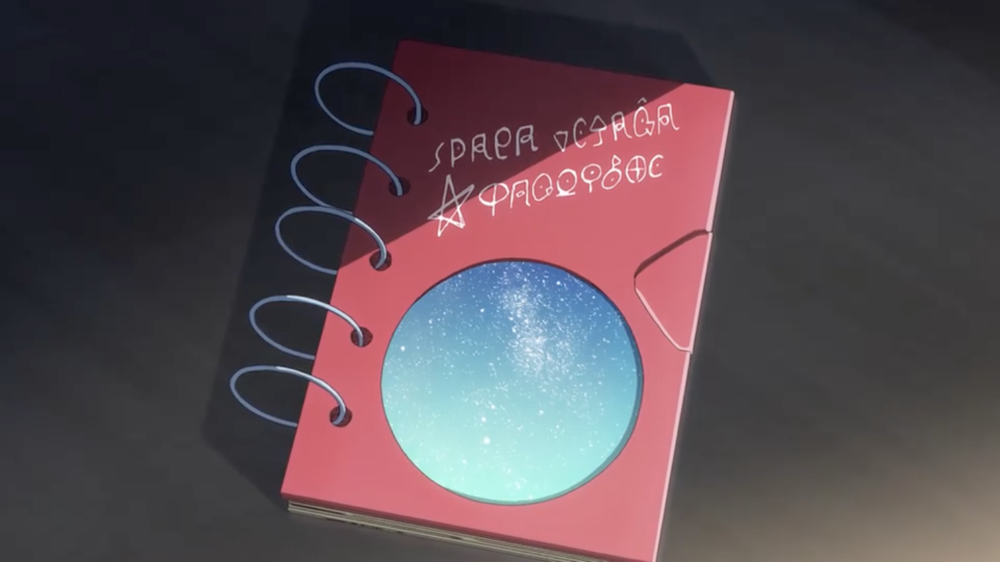
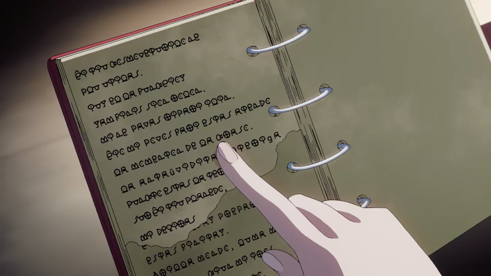
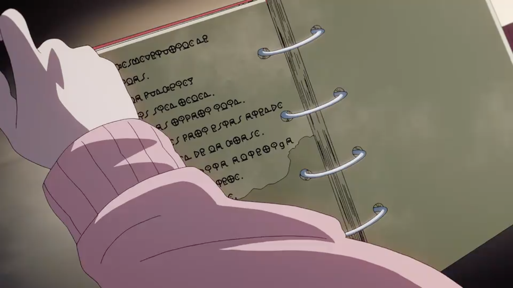
それぞれ19:51、20:17、20:20付近

## 解読手順
私「ラテン文字っぽい文字が多い」「なんか語末にs多いな（例えば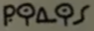）」「表紙に字上符ある（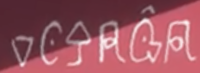）じゃん、エスペラントです」「よくみたら ⟨ŭ⟩ がありますね（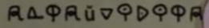）？　じゃあそうだよ」  
→元言語はエスペラント、文字を置き換えただけと推測。ユリアーモっぽい。

私「じゃあ解読してくか……」「手前のページから見ていきます」  
解読済：**s** (1/28)

私「ところで表紙の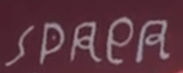、SPACEっぽいですよね」「とすると ⟨e⟩ っぽいやつが c ？」「じゃあ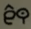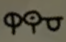は ĉ- なんだろうけど、 ĉi か ĉu か ĉe か……　あ ĉi tiu か」  
解読済：**c**, **ĉ**, **i**, s, **t**, **u** (6/28)

私「ĉ 繋がりで 6 行目を見よう→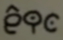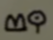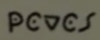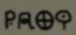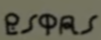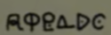」「ĉio……かなあ」「次は形からして mi っぽい」「あー povos だ」「うーん次はわからん（fari …？）」「どうみても estas ですね」「じゃあ ate??o だけど、まあ atendo ですかね」  
解読済：**a**, c, ĉ, **d**, **e**, i, **m**, **n**, **o**, **p**, s, t, u, **v** (14/28)

私「続き、7行目→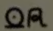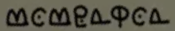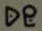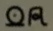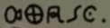」「って ?a ですよね、なんだろう」「momenton」「de」「じゃ la か、筆記体だ」「??aso 、なんでしょうねこれ」  
解読済：a, c, ĉ, d, e, i, **l**, m, n, o, p, s, t, u, v (15/28)

私「8行目→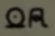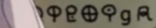」「la」「antaŭvidita—　うおー隠れてる」「—te?iga」「ラテン文字が残ってるの、いいんですかね……」  
解読済：a, c, ĉ, d, e, i, l, m, n, o, p, s, t, u, v (15/28)

私「9行目→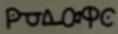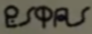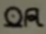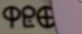」「??n?to\*　謎」「estas la te?— （teroな気はするね ）」  
\* pが解読済であることを忘れています  
解読済：a, c, ĉ, d, e, i, l, m, n, o, p, s, t, u, v (15/28)

私「10行目→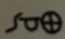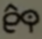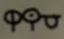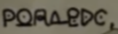」「s??\* ĉi tiu」「planedo か、『惑星』って «planeto» じゃないんだ\*\*」  
\* uが解読済であることを忘れています  
\*\* 後から気付いたんですけど、これ -et- を避けるためだったりします？  
解読済：a, c, ĉ, d, e, i, l, m, n, o, p, s, t, u, v (15/28)

私「11行目→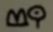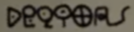」「mi de?i?as…… deziras だろうなあ」
解読済：a, c, ĉ, d, e, i, l, m, n, o, p, **r**, s, t, u, v, **z** (17/28)

私「上に戻りますか、1行目→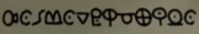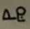」「ĉi tiu」「?osmoveturilo 、kosmoveturilo でしかないでしょ」「ne 、はい」  
解読済：a, c, ĉ, d, e, i, **k**, l, m, n, o, p, r, s, t, u, v, z (18/28)

私「続いて2行目→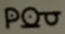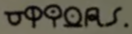」「plu utilas かあ、そんなこと言ってたよね」  
解読済：a, c, ĉ, d, e, i, k, l, m, n, o, p, r, s, t, u, v, z (18/28)

私「3行目→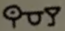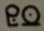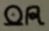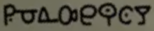」「iu? el la ?unkcio?」「funkcio... j だこれ　なるほどー」  
解読済：a, c, ĉ, d, e, **f**, i, **j**, k, l, m, n, o, p, r, s, t, u, v, z (20/28)

私「4行目→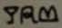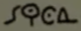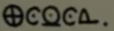」「jam finis sion rolon」  
解読済：a, c, ĉ, d, e, f, i, j, k, l, m, n, o, p, r, s, t, u, v, z (20/28)

私「5行目→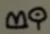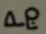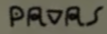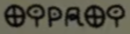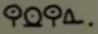」「mi ne pavas ripari ilin」「一応調べたけど、尾羽を広げはしないですね」  
解読済：a, c, ĉ, d, e, f, i, j, k, l, m, n, o, p, r, s, t, u, v, z (20/28)

私「さて、本文も粗方読めたし表紙行くか→ 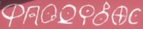」「spaca voja... ĝ か」「ta?li?ro...」「あっ『宇宙航海日誌』って言ってたじゃん、日記は «taglibro» らしいので、その通り当て嵌めればいいですね」  
解読済：a, **b**, c, ĉ, d, e, f, **g**, **ĝ**, i, j, k, l, m, n, o, p, r, s, t, u, v, z (23/28)

〜以上で対応付けは終わり、残りの翻字過程は省略〜

## 解読結果
ということで、解読結果は次のようでした（調べれば2020年の解読例なんかも見つかります。必要に応じて参照してください）。なお、エスペラントの文法に合わない部分は下線を引き、エスペラント文法に合わせた修正案を角括弧で示しています。斜体はラテン文字のまま書かれていた文字です。

表紙：
> spaca vojaĝa  
> taglibro

本文（手前）：
> ĉi tiu kosmoveturilo ne  
> plu utilas.  
> iuj el la funkcioj  
> jam finis <u>sion</u> [sian] rolon\*.  
> mi ne <u>pavas</u> [povas] ripari ilin.  
> <u>ĉio mi povos fari</u> [ĉio, kion mi povas fari,] estas <u>atendo</u> [atendi]  
> la momenton de la <u>kraso</u> [kraŝo]\*\*.  
> la anta*ŭ*vidita <u>alteri<i>g</i>a</u> [alteriĝa]  
> punkto estas la tero.  
> sur ĉi tiu planedo,  
> mi deziras  

\* [PMEG](https://bertilow.com/pmeg/gramatiko/unu-nombro_multe-nombro/uzado/specialaj_okazoj.html#i-81z) に従えば、 funkcio の一つ一つに単一の rolo が対応する場合は «sian rolon» で構いません。実際、ここではそれでよいでしょう（2023/10/19 修正・追記）。  
\*\* 字上符がないので s 相当と解釈しています。

本文（奥）：
> —aj prepar—  
> estas finitaj.  
> <u>brilla</u> [brila] mondo, luma m—  
> —kiun mi ir—  
> —o.

対応表：

| latina | kosma |
| ------ | ------- |
| a      | 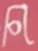 |
| b      |  |
| c, ĉ   | ,  |
| d      |  |
| e      |  |
| f      |  |
| g, ĝ   | ,  |
| h, ĥ   | - - |
| i      |  |
| j, ĵ   | * aŭ , - |
| k      |  |
| l      |  |
| m      |  |
| n      |  |
| o      |  |
| p      |  |
| r      |  |
| s, ŝ   | , - |
| t      |  |
| u, ŭ   | , - |
| v      |  |
| z      |  |

\* 2023/10/19 追記