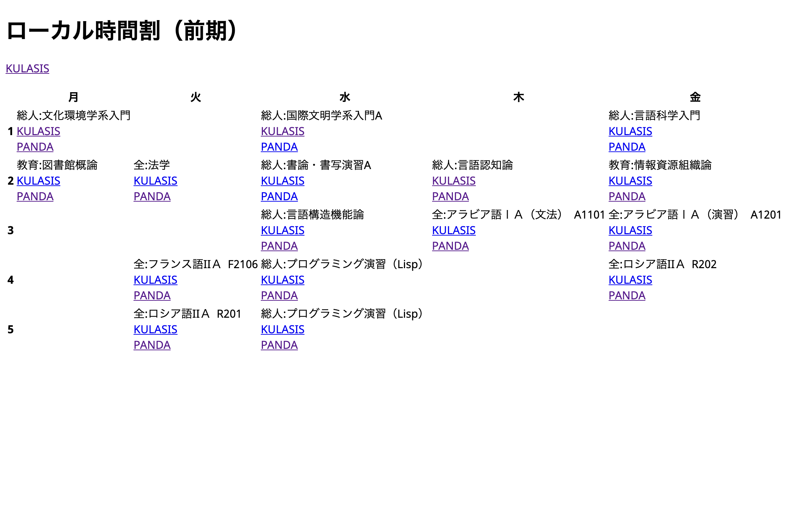

# KUTimetable

## 機能
KULASIS上の時間割をもとに、各授業のKULASISとPandAへのリンク付きの時間割を含むHTMLファイルを生成します。これにより、全ての授業の授業連絡メール（KULASIS）やコースサイト（PandA）により手軽にアクセスすることができるようになります。

## 導入方法
Firefox で利用する場合、このディレクトリ「kutimetable」をダウンロードしたのち、`about:debugging#/runtime/this-firefox`を表示し「一時的なアドオンを読み込む…」から kutimetable 直下のいずれかのファイルを選択することで有効化できます。なお、公式サイトには公開していません。

## 利用方法
アドオンが有効になっている場合、時間割の直上に「Download」と書かれたボタンと説明が追加されます。説明に従って利用してください。

## 対応しているページ
全学共通科目の時間割ページ（[前期の場合](https://www.k.kyoto-u.ac.jp/student/la/entry/zenki)あるいは[後期の場合](https://www.k.kyoto-u.ac.jp/student/la/entry/kouki)）と、それと同様の形式で時間割を表示するページ*にダウンロードボタンが表示されます。例えば、医学部人間健康科学科の時間割ページ（[前](https://www.k.kyoto-u.ac.jp/student/u/medh/entry/zenki)/[後](https://www.k.kyoto-u.ac.jp/student/u/medh/entry/kouki)）には対応していません。また、[履修登録ページ](https://www.k.kyoto-u.ac.jp/student/la/timeslot/timeslot_list)にも対応しています。  
\* 次の正規表現に当てはまる URL で表されるページが該当するはずです：`https://www.k.kyoto-u.ac.jp/student/(la|u/(let|ed|l|ec|s|p|t|a|h)|g/(let|ed|lp|ls|ec|s|med|medh|p|t|a|h|ene|aa|i|bio|gov|is))/entry/(zenki|kouki)`

## 生成例
